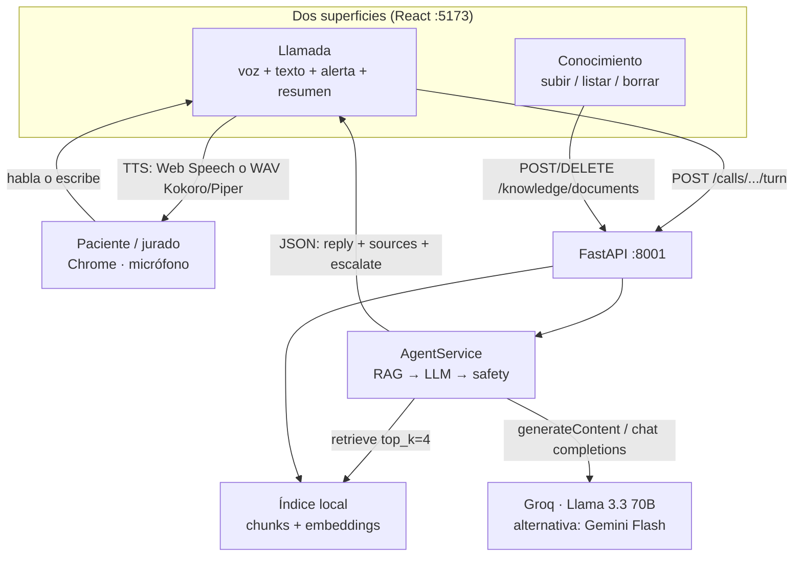
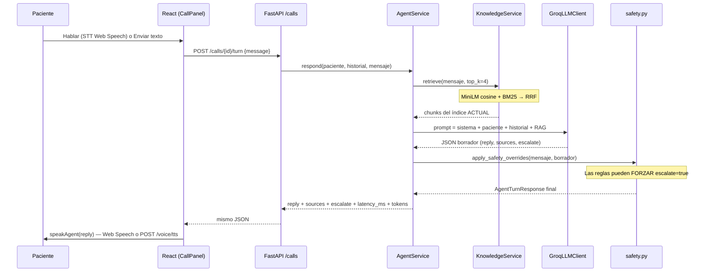
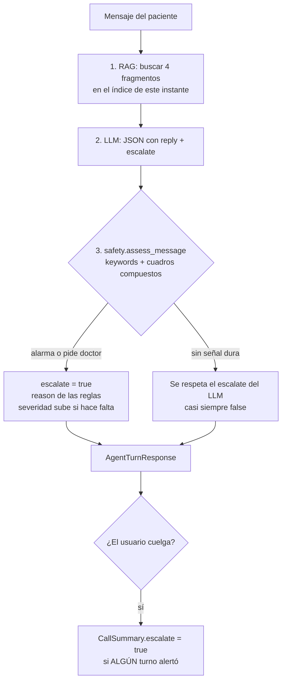
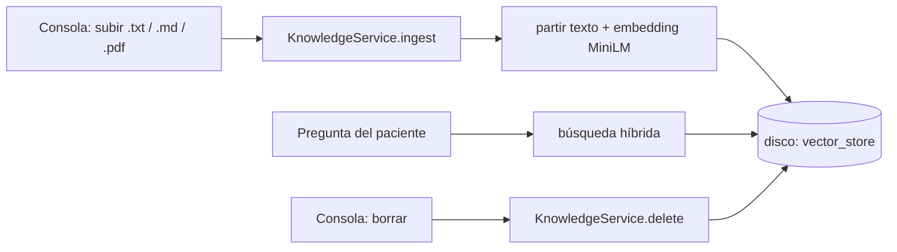
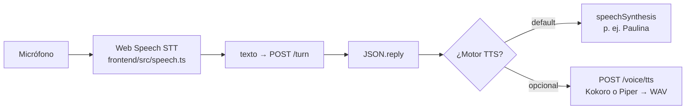
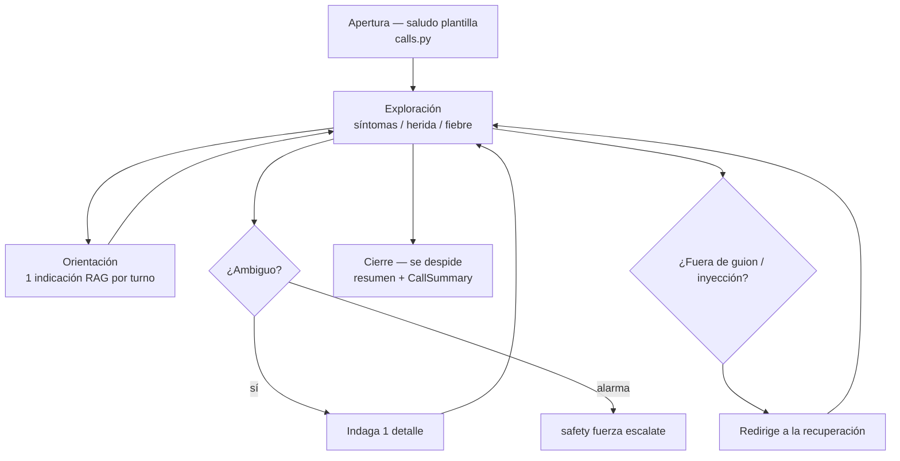

# Arquitectura — Agente de voz post-operatorio

**Entregable 02.** Arquitectura de la solución y flujo de decisión del agente.  
Cada caja de un diagrama apunta a un archivo que el jurado puede abrir.

Informe: [`docs/informe-tecnico.md`](./docs/informe-tecnico.md) · Cómo levantarlo: [`README.md`](./README.md)

---

## Cómo leer esto (60 segundos)

Hay **dos pantallas** y **un pipeline** por turno:

| Superficie | Qué demuestra | Dónde |
|---|---|---|
| **Llamada** | El paciente habla o escribe; el agente responde con voz; puede **alertar a un humano** | pestaña Llamada |
| **Conocimiento** | Subes un documento y el agente lo usa; lo borras y **lo olvida** (incluso en la misma llamada) | pestaña Conocimiento |

Por cada turno del paciente el backend hace **exactamente 1 consulta RAG + 1 llamada al LLM**, y después aplica **reglas de seguridad** que pueden forzar `escalate=true` aunque el modelo haya dicho que no.

El LLM **no “piensa” ni habla solo**: predice un JSON. La UI convierte `reply` en voz.

---

## 1. Contexto del sistema



**Qué no hace el agente:** no llama por teléfono, no escribe en un HIS hospitalario, no reconoce voz en el servidor. El micrófono y (por defecto) la voz de salida viven en el **navegador**.

---

## 2. Un turno — de la voz al JSON y de vuelta

El saludo inicial **no pasa por el LLM**: lo arma `calls.py` al iniciar. El pipeline de abajo corre en cada mensaje del paciente.



Contrato de cada turno (`backend/app/schemas.py` → `AgentTurnResponse`):

`reply` · `sources[]` · `patient_state` · `escalate` · `escalate_reason` · `model_id` · `latency_ms` · `tokens_in/out` · `model_invocations=1` · `rag_queries=1`

Al **colgar** (`POST /calls/{id}/end`) `CallService` arma un `CallSummary`: paciente, procedimiento, síntomas, si hubo alerta en **cualquier** turno, fuentes usadas, P50/P95 y costo estimado.

---

## 3. Flujo de decisión (escalate) — lo que el jurado debe poder auditar

En salud el **falso negativo** (no alertar cuando sí había que alertar) pesa más que alertar de más. Por eso el modelo **propone** y las reglas **pueden imponer**.



**Orden (importante):**

1. El LLM propone `escalate` según `prompts.py`.
2. **Las reglas post-LLM mandan.** `apply_safety_overrides` en `safety.py` puede forzar alerta aunque el modelo haya dicho que no.
3. **No hay atajo pre-LLM** en el camino Groq/Gemini: el modelo siempre corre; las reglas siempre corren después.

Señales duras (ejemplos en código): no poder respirar, sangrado, dolor 8–10/10, fiebre alta, secreción / líquido amarillo, **fiebre + herida**, **dolor alto + fiebre**, “quiero un doctor”.

Calibración: `make eval-escalate` contra etiquetas verde/amarillo/rojo del kit oficial.

En la UI **no aparece** el texto `escalate: true`. Se ve como badge **Severa** + caja **ALERTA HUMANA**.

---

## 4. Conocimiento vivo (G5)

El índice se consulta **en cada turno**. Borrar un documento quita sus chunks; el prompt prohíbe reusar el historial como protocolo.



**Qué significa “híbrida”:** no uso Chroma ni Pinecone. Guardo fragmentos en un almacén propio (`LocalVectorStore`). Para buscar:

1. **Semántica:** MiniLM convierte pregunta y chunks a vectores (384 dimensiones) y mide similitud (coseno).
2. **Léxica:** BM25 encuentra coincidencias de palabras (útil con nombres raros tipo ZETA-42).
3. **Fusión:** RRF mezcla los dos rankings.

**Olvidar en la misma llamada:** las pestañas Llamada y Conocimiento **siguen montadas** (`frontend/src/App.tsx`). Subes → preguntas → citas el doc → borras → preguntas otra vez → el RAG ya no lo trae y el prompt manda declarar el límite en vez de repetir el turno anterior.

API: `POST /knowledge/documents` · `GET /knowledge/documents` · `DELETE /knowledge/documents/{doc_id}` · `POST /knowledge/query`

Citas: el LLM puede devolver `sources`; si vienen vacíos o inválidos, `parsing.build_sources` usa hasta 2 hits reales del RAG.

---

## 5. Voz (G4) — separado del razonamiento



| Pieza | Default de la demo | Alternativa |
|---|---|---|
| STT (voz → texto) | Navegador (Chrome/Edge) | Whisper en servidor = trabajo futuro |
| TTS (texto → voz) | Navegador | Kokoro / Piper si corriste `make warm-*` |

El paciente puede **interrumpir** el TTS (barge-in) con Hablar/Enviar. Durante la espera de red: banner “Pensando…”.

---

## 6. Caja del diagrama → archivo (auditoría)

Si el jurado toma una caja al azar, este es el archivo:

| Caja / idea | Archivo |
|---|---|
| UI Llamada | `frontend/src/components/CallPanel.tsx`, `hooks/useCallSession.ts` |
| UI Conocimiento | `frontend/src/components/KnowledgeConsole.tsx` |
| Pestañas sin perder la llamada | `frontend/src/App.tsx` |
| STT / TTS navegador | `frontend/src/speech.ts`, `serverTts.ts` |
| HTTP llamadas | `backend/app/api/calls.py` |
| HTTP conocimiento | `backend/app/api/knowledge.py` |
| HTTP voz servidor | `backend/app/api/voice.py` |
| Orquestación del turno | `backend/app/agent/service.py` |
| Prompt + agenda suave | `backend/app/agent/prompts.py` |
| Parseo JSON + citas | `backend/app/agent/parsing.py` |
| LLM Groq / Gemini / mock | `backend/app/agent/llm_groq.py`, `llm_gemini.py`, `llm_mock.py` |
| Factory (bloquea Anthropic) | `backend/app/agent/factory.py` |
| Reglas de escalate | `backend/app/agent/safety.py` |
| Historial + resumen al colgar | `backend/app/calls/service.py` |
| RAG ingest / retrieve / delete | `backend/app/rag/service.py` |
| Índice MiniLM + BM25 + RRF | `backend/app/rag/store.py` |
| Embeddings | `backend/app/rag/embeddings.py` |
| Puertos | `backend/app/ports.py` (`LLMClient`, `KnowledgePort`) |
| Cableado | `backend/app/api/deps.py` |
| Contrato JSON | `backend/app/schemas.py` |
| TTS Kokoro / Piper | `backend/app/voice/kokoro_engine.py`, `piper_engine.py` |

**Modelo permitido:** Gemini Flash · Llama vía Groq · Llama/Phi local. Anthropic se rechaza en `factory.py` (compuerta G3).

---

## 7. Cómo está armado el código (ports / adapters)

```text
React UI  →  routers FastAPI  →  casos de uso
                                 AgentService · CallService · KnowledgeService
                                      │ dependen de puertos (Protocol)
                                      ▼
                                 Groq / Gemini / Mock
                                 LocalVectorStore
```

`AgentService` no importa Groq ni el disco: recibe `LLMClient` y `KnowledgePort`. Cambiar de Groq a Gemini es `LLM_PROVIDER` + factory, no reescribir el turno.

---

## 8. Conversación (lo que oye el paciente)

No hay una máquina de estados clínica rígida. Hay una **agenda suave** en el prompt:



| Lo que pide la rúbrica | Qué hace el código |
|---|---|
| Abrir / conducir / cerrar | Saludo plantilla → agenda en prompt → colgar + `CallSummary` |
| Fuera de guion | Prompt redirige; ignora cambio de rol; “quiero un doctor” escala |
| Instrucciones largas | Una indicación por turno; pregunta antes de la siguiente |
| Silencios | Banner pensando / escuchando; barge-in corta el TTS |

---

## 9. Configuración de runtime

De `backend/.env` (plantilla: `.env.example`):

| Clave | Rol |
|---|---|
| `LLM_PROVIDER` | `groq` (demo) · `gemini` · `mock` |
| `MODEL_ID` | p. ej. `llama-3.3-70b-versatile` |
| `GROQ_API_KEY` / `GEMINI_API_KEY` | credenciales |
| `EMBED_PROVIDER` | `fastembed` (default) · `hash` (sin descargar modelo) |
| `TTS_PROVIDER` | `auto` · `kokoro` · `piper` · `browser` |
| `KOKORO_VOICE` | p. ej. `ef_dora` |
| `PIPER_VOICE` | p. ej. `es_MX-ald-medium` |
| `DATA_DIR` | uploads + índice + `calls.json` |

Al arrancar, `main.py` reconstruye vectores si cambió el embedder y siembra un protocolo genérico si el índice está vacío.

---

## 10. Cubierto vs fuera de alcance

**Cubierto:** llamada de voz en el navegador, RAG con citas, conocimiento en caliente, escalate con asimetría clínica, resumen al colgar, métricas P50/P95 y tokens.

**A propósito no está:** telefonía real / HIS, login empresarial, STT en servidor, base vectorial externa (Chroma / BGE-M3 = si hubiera dos semanas más).
