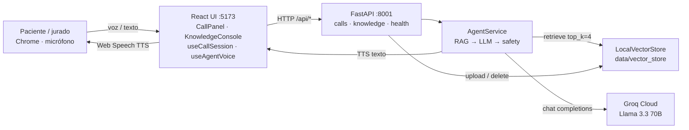
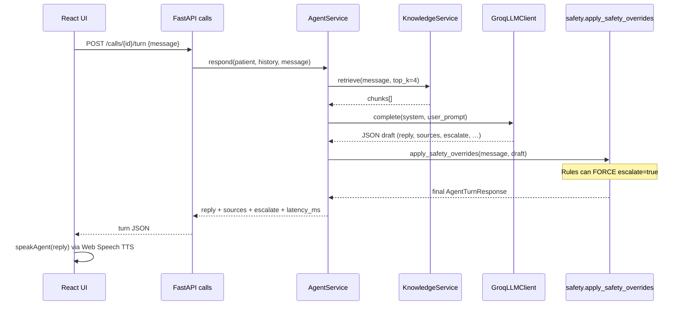
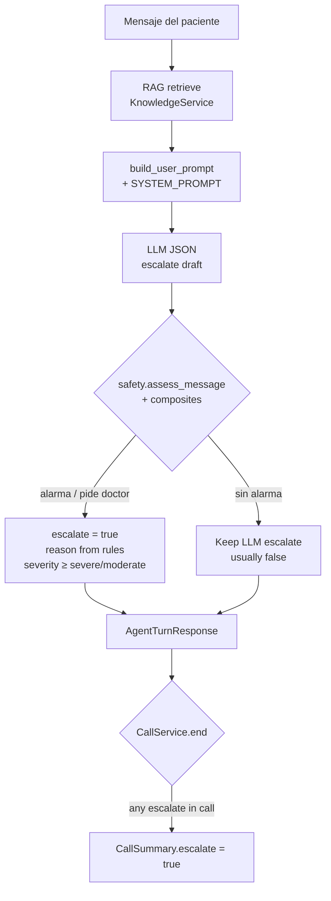
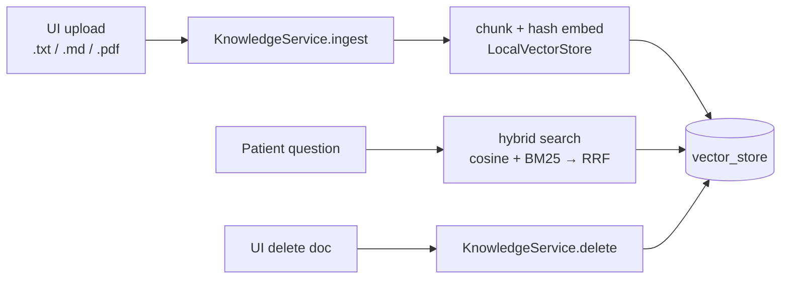

# Architecture — Tech Sphere Voice Agent

**Deliverable 02.** Architecture of the solution and the agent decision flow.  
Every box maps to code the jury can open (paths below).

Related: [`docs/informe-tecnico.md`](./docs/informe-tecnico.md) · [`STATUS.md`](./STATUS.md) · [`README.md`](./README.md)

---

## 1. System context



| Layer | Path |
|---|---|
| UI call + knowledge | `frontend/src/components/` |
| Voice STT/TTS | `frontend/src/speech.ts`, `hooks/useAgentVoice.ts`, `hooks/useCallSession.ts` |
| HTTP adapters | `backend/app/api/` |
| Use-cases | `backend/app/agent/service.py`, `calls/service.py`, `rag/service.py` |
| Ports | `backend/app/ports.py` (`LLMClient`, `KnowledgePort`) |
| LLM adapters | `backend/app/agent/llm_groq.py`, `llm_gemini.py`, `llm_mock.py` |
| Factory | `backend/app/agent/factory.py` |
| Safety | `backend/app/agent/safety.py` |
| Prompts | `backend/app/agent/prompts.py` |
| RAG store | `backend/app/rag/store.py` (hash cosine + BM25 → RRF hybrid) |

**Allowed LLM only:** Gemini Flash · Llama via Groq · local Llama/Phi. Anthropic is rejected in `factory.py`.

---

## 2. One turn (sequence)



Contract (`backend/app/schemas.py` → `AgentTurnResponse`):

`reply` · `sources[]` · `patient_state` · `escalate` · `escalate_reason` · `model_id` · `latency_ms`

---

## 3. Agent decision flow (escalate)



**Order (important):**

1. LLM proposes `escalate` (prompt in `prompts.py`).
2. **Post-LLM guards are authoritative** — `apply_safety_overrides` in `safety.py` can force escalate even if the model said no.
3. There is **no** pre-LLM short-circuit on the Groq path; rules always run after the model.

Hard signals include: respiratory distress, heavy bleeding, high pain (8–10/10), high fever, purulent wound ± fever composites, explicit “quiero un doctor”.

Calibrated with `make eval-escalate` against kit verde/amarillo/rojo labels.

---

## 4. Hot knowledge (live console)



API: `POST /knowledge/documents` · `POST /knowledge/query` · `DELETE /knowledge/documents/{doc_id}`  
(`backend/app/api/knowledge.py`)

After delete, chunks are gone — the next turn cannot cite that document.

---

## 5. Ports / adapters (SOLID)

```text
UI (React)
        │ /api/*
        ▼
API routers                 ← inbound adapters
        ▼
Use-cases                   ← AgentService, CallService, KnowledgeService
        │ depends on ports
        ▼
Ports (Protocol)            ← LLMClient, KnowledgePort
        ▼
Adapters                    ← Groq / Gemini / Mock · LocalVectorStore
```

| Principle | Where |
|---|---|
| SRP | `safety.py` vs `llm_*` vs `parsing` |
| OCP | New LLM = subclass `PromptedLLMClient` + `factory.py` branch |
| LSP | Mock / Groq / Gemini all satisfy `LLMClient` |
| ISP | Small ports only |
| DIP | `AgentService` depends on Protocols; wiring in `api/deps.py` |

---

## 6. Runtime configuration

From `backend/.env` (see `.env.example`):

| Key | Role |
|---|---|
| `LLM_PROVIDER` | `groq` (default for demo) · `gemini` · `mock` |
| `MODEL_ID` | e.g. `llama-3.3-70b-versatile` |
| `GROQ_API_KEY` / `GEMINI_API_KEY` | Cloud credentials |
| `CORS_ORIGINS` | UI origin |
| `DATA_DIR` | Uploads + vector store + calls JSON |

---

## 7. What is intentionally out of scope

- Real telephony / hospital HIS
- Enterprise auth / roles
- Server-side STT/TTS (browser Web Speech only today)
- External vector DB (local hash embeddings; upgrade path noted in STATUS)
