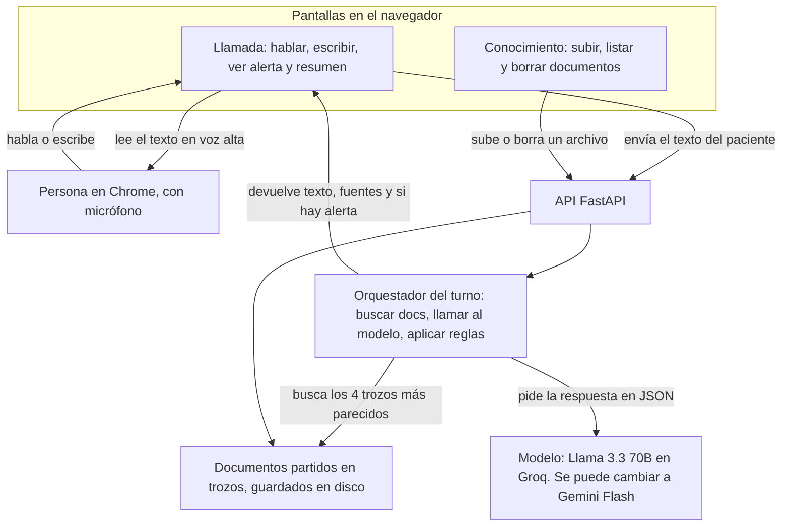
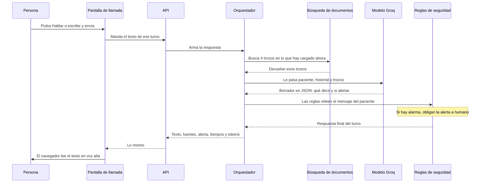
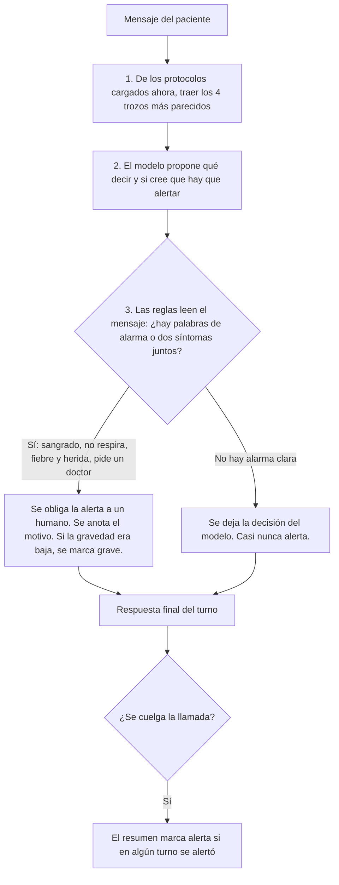
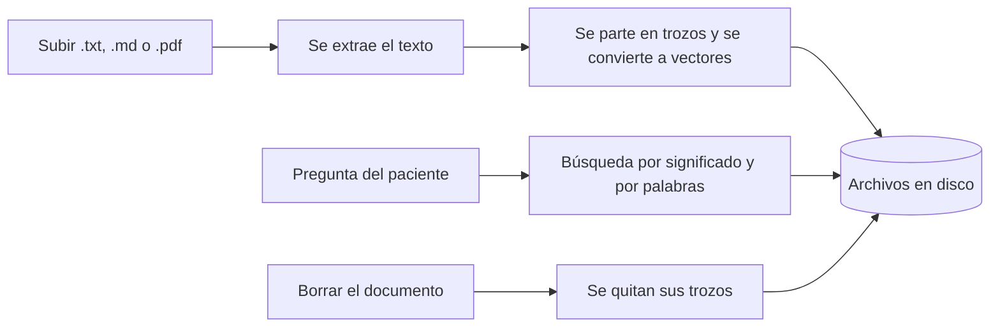
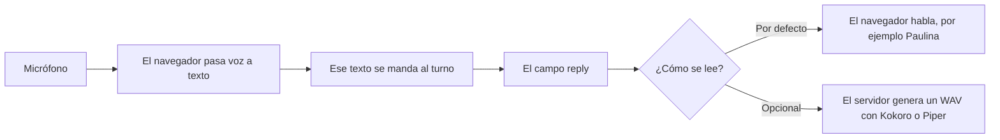
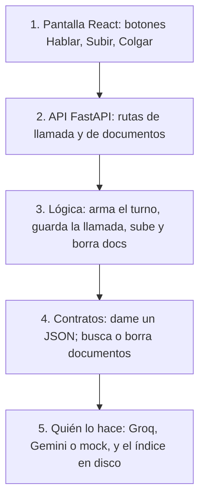

# Arquitectura — Agente de voz post-operatorio

**Entregable 02.** Arquitectura de la solución y flujo de decisión del agente.  
Cada recuadro de un diagrama tiene su archivo en el repositorio.

Informe: [`docs/informe-tecnico.md`](./docs/informe-tecnico.md) · Cómo levantarlo: [`README.md`](./README.md)

---

## Cómo leer esto

Hay **dos pantallas** y **un pipeline** por turno:

| Pantalla | Qué hace | Dónde |
|---|---|---|
| **Llamada** | El paciente habla o escribe; el agente responde con voz; puede **alertar a un humano** | pestaña Llamada |
| **Conocimiento** | Subes un documento y el agente lo usa; lo borras y **lo olvida** (incluso en la misma llamada) | pestaña Conocimiento |

Por cada mensaje del paciente el backend hace **1 búsqueda en documentos + 1 llamada al modelo**, y después aplica **reglas de seguridad**. Esas reglas pueden **obligar** una alerta a humano aunque el modelo haya dicho que no.

El modelo **no habla solo**: escribe un JSON. La pantalla convierte el campo `reply` en voz.

---

## 1. Contexto del sistema

Quién habla con quién. No hay teléfono de hospital: todo pasa por Chrome.

El micrófono y, por defecto, la voz de salida están en el **navegador**. El servidor no escucha el audio.

---

## 2. Un turno: de lo que dice el paciente a la voz del agente

El **saludo** al iniciar la llamada lo escribe el backend (`calls.py`), no el modelo. El dibujo de abajo es cada mensaje **después** de ese saludo.

**Qué trae cada turno** (campos en `backend/app/schemas.py`):

| Campo | En simple |
|---|---|
| `reply` | Lo que se le dice al paciente (y se lee en voz) |
| `sources` | De qué documento salió la parte clínica |
| `patient_state` | Síntomas y gravedad estimada |
| `escalate` | ¿Hay que avisar a un humano? |
| `escalate_reason` | Motivo corto para el clínico |
| `latency_ms` / tokens | Tiempos y consumo del modelo |
| 1 búsqueda + 1 llamada al modelo | Siempre, en cada turno |

**Al colgar:** se guarda un resumen con nombre, procedimiento, síntomas, si **en algún turno** hubo alerta, documentos usados, latencias y costo estimado.

---

## 3. Flujo de decisión (alerta a humano)

En salud es peor **no alertar** cuando sí había que alertar, que alertar de más. El modelo **propone**; las reglas **pueden imponer**.

**Paso 3, en simple:**

- El modelo **ya contestó**. `safety.py` vuelve a leer **las palabras del paciente**, no la opinión del modelo.
- **Palabras de alarma:** “sangrado”, “no puedo respirar”, “quiero un doctor” → se **obliga** avisar a un humano. En pantalla se ve **ALERTA HUMANA**, no el texto `escalate = true`.
- **Dos síntomas juntos:** fiebre + secreción en la herida también disparan, aunque cada uno solo sea más débil.
- **Motivo:** frase corta para el clínico, no para leérsela al paciente.
- **Gravedad:** si el modelo puso “leve” y las reglas vieron algo grave, se **corrige a grave**. Nunca se baja una alarma.

**Orden:**

1. El modelo propone si alertar (`prompts.py`).
2. Las reglas **mandan después**. Pueden forzar alerta aunque el modelo haya dicho que no.
3. En Groq/Gemini el modelo **siempre** corre; las reglas **siempre** corren después. No hay atajo que salte el modelo.

Ejemplos en código: no poder respirar, sangrado, dolor 8–10/10, fiebre alta, líquido amarillo, fiebre + herida, dolor alto + fiebre, “quiero un doctor”.

**Prueba automática (`make eval-escalate`):** el kit oficial marca llamadas de ejemplo como verde (estable), amarillo (dudoso) o rojo (hay que alertar). El script pasa esas frases por el mismo pipeline.

- **Rojo** debe alertar. Si no, el examen falla.
- **Verde** no debería alertar. Si alerta, cuenta como falso positivo.
- **Amarillo** es zona gris: se **anota** si alertó o no, pero **no entra** en la nota dura. Ni aprueba ni desaprueba.

En la muestra del informe: rojo 2/2 alertaron, verde 0/4 falsos positivos (por eso “rojo y verde salieron bien”). Amarillo no tiene meta de acierto.

---

## 4. Conocimiento vivo

El índice se consulta **en cada turno**. Borrar un documento quita sus trozos. El prompt prohíbe usar el historial de la charla como si fuera un protocolo.

**Búsqueda híbrida:** no uso Chroma ni Pinecone. Guardo los trozos en un almacén propio (`LocalVectorStore.search`). MiniLM y BM25 **no corren en paralelo** (no hay dos hilos): en el mismo `search()` se calculan **uno detrás del otro** y luego se juntan.

1. **MiniLM (significado):** convierte pregunta y trozos a vectores y ordena por parecido (coseno).
2. **BM25 (palabras):** ordena por coincidencias de términos. Sirve con nombres raros tipo ZETA-42.
3. **RRF (mezcla):** no se suman los puntajes crudos (no están en la misma escala). Cada puesto aporta `1 / (60 + puesto)`: el 1.º suma más que el 10.º. Gana quien queda bien ubicado en las dos listas, o muy arriba en una.

Al final se devuelven los **4** mejores de esa mezcla.

**Olvidar en la misma llamada:** las pestañas Llamada y Conocimiento siguen abiertas por debajo (`App.tsx`). Subes → preguntas → se cita el doc → borras → preguntas otra vez → ya no está en el índice y el agente declara que no tiene esa indicación.

Rutas: subir, listar, borrar y consultar documentos bajo `/knowledge/`.

**Citas en pantalla:** si el modelo lista bien las fuentes, se muestran. Si las deja vacías o mal escritas, el backend **no inventa un PDF**: copia hasta **los 2 primeros trozos que la búsqueda sí encontró** en este turno (título + extracto).

---

## 5. Voz — aparte del razonamiento

| Pieza | En la demo | Alternativa |
|---|---|---|
| Voz → texto | Chrome / Edge | Whisper en servidor (no está) |
| Texto → voz | Navegador | Kokoro / Piper si se descargaron los modelos |

Se puede **interrumpir** la voz del agente con Hablar o Enviar. Mientras espera la red: “Pensando…”.

---

## 6. Recuadro del diagrama → archivo

Si ves un recuadro en un diagrama, este es el código:

| Recuadro / idea | Archivo |
|---|---|
| UI Llamada | `frontend/src/components/CallPanel.tsx`, `hooks/useCallSession.ts` |
| UI Conocimiento | `frontend/src/components/KnowledgeConsole.tsx` |
| Pestañas sin perder la llamada | `frontend/src/App.tsx` |
| Voz en el navegador | `frontend/src/speech.ts`, `serverTts.ts` |
| HTTP llamadas | `backend/app/api/calls.py` |
| HTTP conocimiento | `backend/app/api/knowledge.py` |
| HTTP voz del servidor | `backend/app/api/voice.py` |
| Orquestación del turno | `backend/app/agent/service.py` |
| Prompt | `backend/app/agent/prompts.py` |
| Parseo JSON y citas | `backend/app/agent/parsing.py` |
| Groq / Gemini / mock | `backend/app/agent/llm_groq.py`, `llm_gemini.py`, `llm_mock.py` |
| Elige el modelo (bloquea Anthropic) | `backend/app/agent/factory.py` |
| Reglas de alerta | `backend/app/agent/safety.py` |
| Historial y resumen al colgar | `backend/app/calls/service.py` |
| Subir, buscar y borrar docs | `backend/app/rag/service.py` |
| Índice en disco | `backend/app/rag/store.py` |
| Vectores MiniLM | `backend/app/rag/embeddings.py` |
| Contratos | `backend/app/ports.py` |
| Cableado al arrancar | `backend/app/api/deps.py` |
| Forma del JSON | `backend/app/schemas.py` |
| Kokoro / Piper | `backend/app/voice/kokoro_engine.py`, `piper_engine.py` |

Modelo permitido: Gemini Flash, Llama en Groq, o Llama/Phi local. Anthropic se rechaza en `factory.py`.

---

## 7. Cómo está armado el código (capas)

La pantalla no habla con Groq. Cada capa solo habla con la de al lado:

`AgentService` no tiene pegado el nombre Groq. Pide “un cliente de modelo”. Al arrancar, `factory.py` le entrega Groq, Gemini o mock según `.env`. Cambiar de proveedor no reescribe el turno: solo cambia quién está detrás del contrato.

Lo mismo con documentos. El orquestador no abre el PDF ni el `.txt`: solo pide “busca 4 trozos”. Quien responde es el índice (`store.py`). Cuando subiste el archivo, ya se extrajo el texto, se partió y se guardó en disco. En cada pregunta se busca **en esos trozos**, no se vuelve a leer el original.

---

## 8. Configuración

De `backend/.env` (plantilla: `.env.example`):

| Clave | Rol |
|---|---|
| `LLM_PROVIDER` | `groq` · `gemini` · `mock` |
| `MODEL_ID` | p. ej. `llama-3.3-70b-versatile` |
| `GROQ_API_KEY` / `GEMINI_API_KEY` | credenciales |
| `EMBED_PROVIDER` | `fastembed` · `hash` (sin descargar modelo) |
| `TTS_PROVIDER` | `auto` · `kokoro` · `piper` · `browser` |
| `KOKORO_VOICE` | p. ej. `ef_dora` |
| `PIPER_VOICE` | p. ej. `es_MX-ald-medium` |
| `DATA_DIR` | archivos subidos, índice y llamadas |

Al arrancar, `main.py` reconstruye vectores si cambió el modelo de embeddings y carga un protocolo genérico si no hay documentos.
