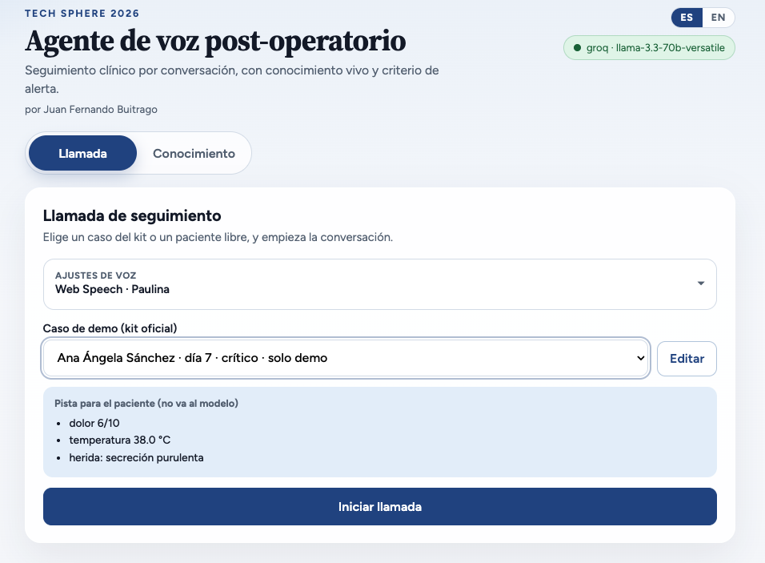
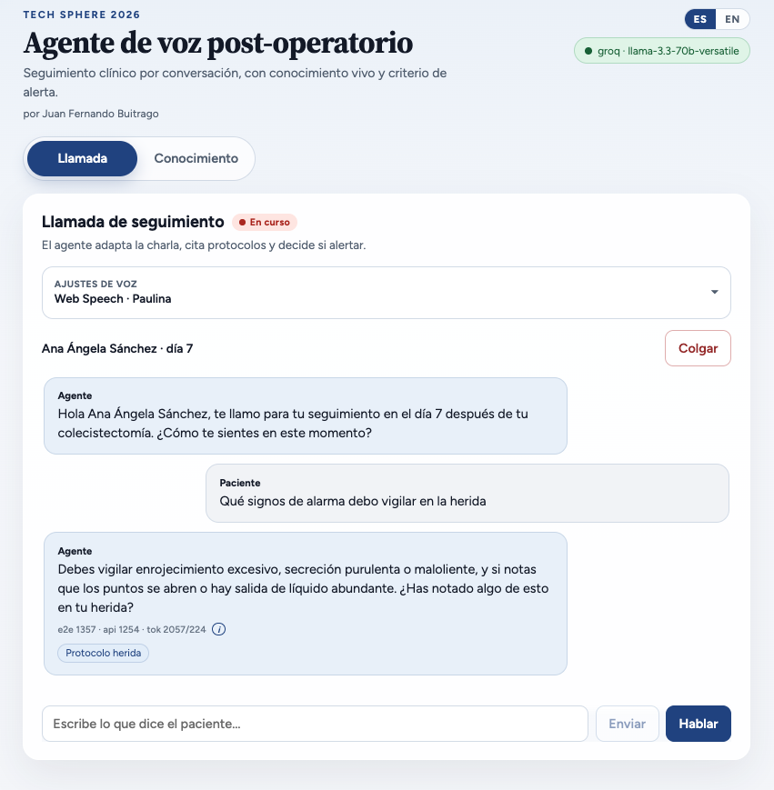
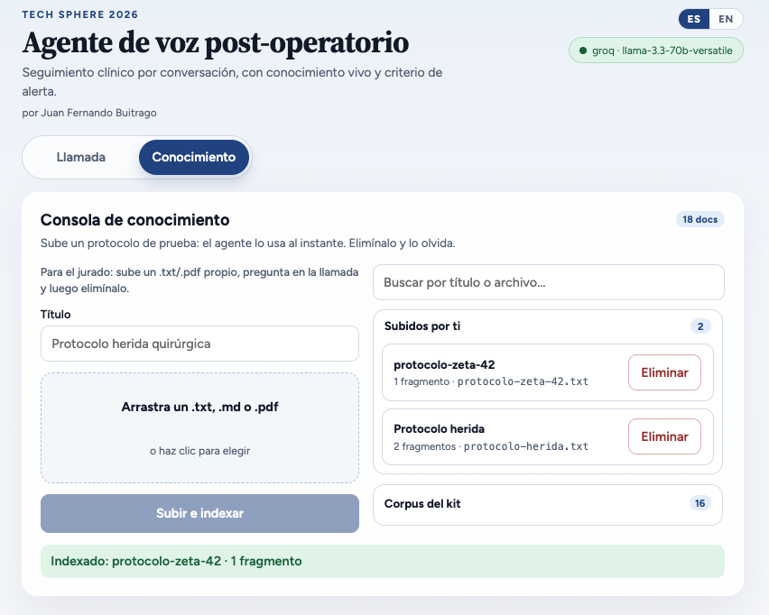
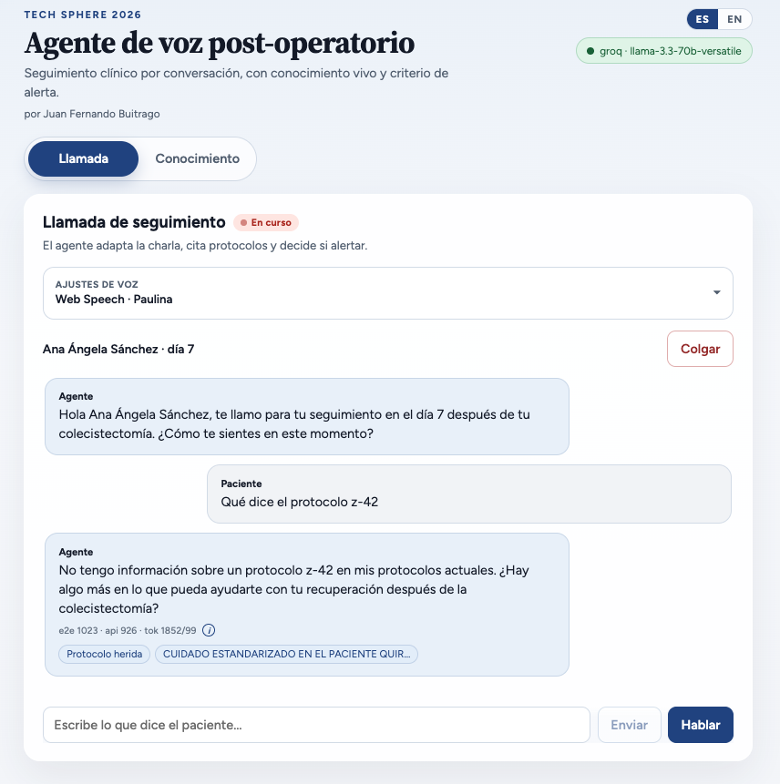
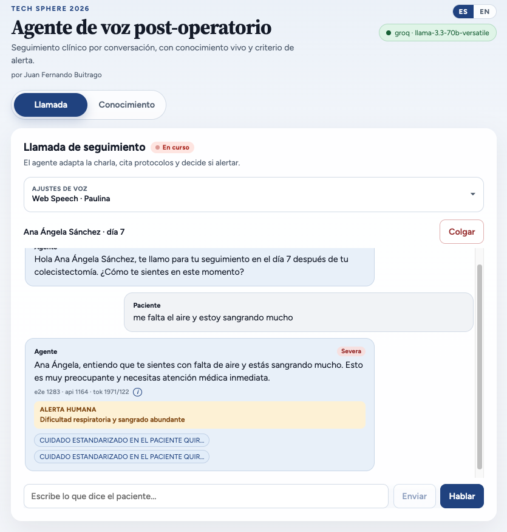
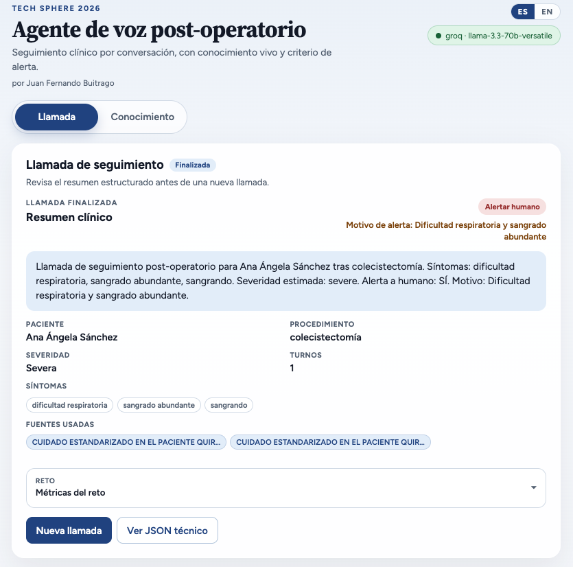
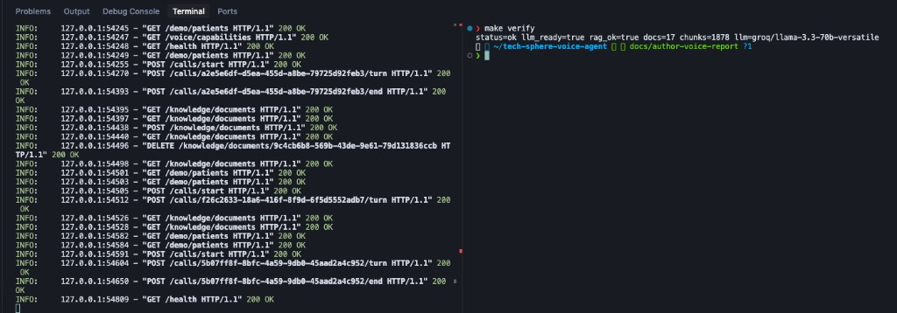

# Informe técnico — Agente de voz post-operatorio

**Entregable 03.** Qué modelo usé, por qué, cómo lo configuré, cómo escribí los prompts, qué medí y qué se ve en el demo.

**Repositorio:** https://github.com/jfernand196/tech-sphere-voice-agent  
**Diagrama (entregable 02):** [`../ARCHITECTURE.md`](../ARCHITECTURE.md)  
**Cómo levantarlo (entregable 01):** [`../README.md`](../README.md)  
**Fecha:** 2026-08-12

---

## Cómo leer esto

Este archivo es **evidencia de proceso**, no el dibujo del sistema.

| Si buscas… | Ve a… |
|---|---|
| Recuadros, un turno, alerta, capas | [`ARCHITECTURE.md`](../ARCHITECTURE.md) |
| Levantar la app en ≤15 min | [`README.md`](../README.md) |
| Modelo, prompts, métricas, capturas | Este documento |

Cada afirmación de aquí se puede contrastar con un archivo del repo o con una captura. No reporto intenciones: reporto lo que corre.

---

## 1. Qué construí

Un **agente de voz en el navegador** para seguimiento post-operatorio en español de Colombia. No hay teléfono de hospital: el paciente habla o escribe en Chrome; el agente responde en voz.

En cada mensaje hago tres cosas, siempre en este orden:

1. Busco en los protocolos **cargados ahora** (no reabro el PDF original).
2. El modelo propone qué decir y si cree que hay que avisar a un humano.
3. Unas **reglas** releen las palabras del paciente. Si hay alarma, **obligan** la alerta aunque el modelo haya dicho que no.

Al colgar se guarda un resumen: síntomas, si en **algún** turno hubo alerta, documentos usados, tiempos y costo.

Se levanta en **≤15 minutos** solo con el README: `make setup` → clave Groq → `make backend` / `make frontend` → `make verify`.

---

## 2. Qué modelo usé y por qué (obligatorio)

| Campo | Valor |
|---|---|
| **Familia permitida** | Meta **Llama** por **Groq** (plan gratuito) |
| **Modelo exacto** | `llama-3.3-70b-versatile` |
| **Variable** | `LLM_PROVIDER=groq` |
| **Dónde se llama** | `backend/app/agent/llm_groq.py` |
| **Quién lo elige** | `backend/app/agent/factory.py` — si pones Anthropic/Claude, **se rechaza** |

### Por qué este y no otro

El cuello de botella de un agente de voz no es “pensar más”: es el tiempo hasta que **empieza a hablar**. Elegí Groq Llama 70B porque, en una llamada real de 10 turnos con micrófono (Web Speech para oír y para hablar), medí:

- del silencio del paciente al audio del agente: **P50 1136 ms / P95 1427 ms**
- del texto al JSON del turno (búsqueda + modelo + reglas): **P50 1044 ms / P95 1337 ms**

Eso cabe en una conversación hablada. Temperatura **0.2** para que el JSON del turno (`reply`, `sources`, `escalate`, …) salga estable.

La familia Llama en Groq está en la lista cerrada del reto. Anthropic/Claude **descalifica**; el factory no lo deja pasar.

### Alternativas que evalué y no dejé como default

| Opción | Qué tiene a favor | Por qué no es el default |
|---|---|---|
| **Gemini Flash** | Ventana de contexto más larga si el corpus RAG crece | En voz prioricé latencia de turno. Queda cableado: `LLM_PROVIDER=gemini` |
| **Llama o Phi en Ollama (local)** | Cero API, corre en laptop | El cold start de 15 min se rompe si hay que instalar y bajar un modelo local. No es el camino del README |

El razonamiento clínico **no** se lo dejo solo al modelo. Las reglas de `safety.py` mandan después. El modelo propone el texto y un `escalate`; las reglas pueden cambiar el `escalate` a verdadero. Detalle en [`ARCHITECTURE.md`](../ARCHITECTURE.md) §3.

---

## 3. Mapa al código (sin repetir el diagrama)

El dibujo completo está en [`ARCHITECTURE.md`](../ARCHITECTURE.md). Aquí, qué pieza decide qué:

| Pieza | Decisión | Archivo |
|---|---|---|
| Orquestación del turno | 1 búsqueda + 1 llamada al modelo + reglas | `backend/app/agent/service.py` |
| Contrato del JSON | Forma fija de cada turno | `backend/app/schemas.py` |
| Voz | El navegador pasa voz a texto y, por defecto, lee la respuesta. Kokoro o Piper son opt-in | `frontend/src/speech.ts`, `backend/app/voice/` |
| Documentos | Índice propio en disco (no Chroma ni Pinecone) | `backend/app/rag/store.py` |
| Alerta a humano | El modelo propone; las reglas pueden imponer | `prompts.py` + `safety.py` |
| Historial y resumen | JSON en `DATA_DIR` | `backend/app/calls/` |

`AgentService` no tiene pegado el nombre Groq. Pide “un cliente de modelo”. Al arrancar, el factory le entrega Groq, Gemini o mock según `.env`. Cambiar de proveedor no reescribe el turno.

Con documentos igual: el orquestador pide “busca 4 trozos”. No abre el PDF. Cuando subiste el archivo, ya se extrajo el texto, se partió y se guardó. En cada pregunta se busca **en esos trozos**.

---

## 4. Configuración

Plantilla: [`.env.example`](../.env.example) → `backend/.env`.

```env
LLM_PROVIDER=groq
MODEL_ID=llama-3.3-70b-versatile
GROQ_API_KEY=gsk_...
CORS_ORIGINS=http://localhost:5173
DATA_DIR=./data
EMBED_PROVIDER=fastembed
```

**Embeddings:** `paraphrase-multilingual-MiniLM-L12-v2` con **fastembed** (ONNX, sin PyTorch). `make setup` descarga el modelo (~220 MB) para que el primer arranque no se quede colgado. Si no hay red para bajarlo: `EMBED_PROVIDER=hash` (peor calidad; sirve para pruebas).

**Puertos:** API **8001**, UI **5173**. Comprobación: `make smoke-groq` y `make verify`.

Dependencias fijadas: `backend/requirements.txt`, `frontend/package.json`.

---

## 5. Prompts

Fuente completa: `backend/app/agent/prompts.py`.

El modelo **no habla solo**. El system prompt le pide un JSON. La pantalla lee en voz el campo `reply`. Las citas van en `sources` para el clínico; **no se leen al paciente**.

### Qué le pido al modelo (extracto)

```
Eres un agente de voz de seguimiento post-operatorio en español (Colombia).
Fundamentar solo en el material de referencia de ESTE turno; citar en sources (no en voz).
Reply: 2–3 oraciones, sin jerga interna (RAG, LLM, prompt), sin repetir síntomas
ni “ve al médico” en cada turno si ya escalaste.
escalate_reason: ≤120 caracteres, para el equipo, no para leérselo al paciente.
Si el documento ya no está en el material de este turno, no lo saques del historial:
declara el límite.
JSON: reply, sources, patient_state, escalate, escalate_reason.
```

### Qué le paso en cada turno (`build_user_prompt`)

Nombre, procedimiento, día post-operatorio, últimos **8** turnos (continuidad, **no** como protocolo), los **4** trozos recuperados y el mensaje actual.

### Cómo los fui ajustando

| Qué fallaba | Qué cambié |
|---|---|
| El modelo a veces no alertaba con secreción + fiebre | En `safety.py`: fiebre + herida, y dolor alto + fiebre, **obligan** alerta |
| “Quiero un doctor” no siempre escalaba | Palabras clave `quiero un doctor` / `hablar con un humano` fuerzan alerta |
| Tras borrar un PDF, repetía la indicación del historial | El prompt prohíbe usar el historial como protocolo; tiene que declarar el límite |
| Etiquetas del kit (rojo / verde) | Harness `make eval-escalate` — ver §6 |

Las reglas **no sustituyen** al modelo: en Groq/Gemini el modelo **siempre** corre y las reglas **siempre** corren después. No hay atajo que salte el modelo.

---

## 6. Cómo decido alertar a un humano

En salud es peor **no alertar** cuando sí había que alertar, que alertar de más.

1. Recupero **4** trozos de lo que hay indexado ahora.
2. El modelo propone el JSON, incluido `escalate`.
3. `apply_safety_overrides` lee **las palabras del paciente**, no la opinión del modelo. Si hay alarma, fuerza `escalate=true`, anota el motivo y, si la gravedad venía “leve”, la sube a grave. **Nunca baja** una alarma.
4. Al colgar, el resumen marca alerta si **cualquier** turno alertó.

Ejemplos que disparan las reglas: no poder respirar, sangrado, dolor 8–10/10, líquido amarillo, fiebre + herida, dolor alto + fiebre, “quiero un doctor”. Fiebre sola es más débil: no obliga por sí misma.

### Examen automático (`make eval-escalate`)

El kit oficial marca llamadas de ejemplo como **verde** (estable), **amarillo** (dudoso) o **rojo** (hay que alertar). El script pasa esas frases por el mismo pipeline.

| Color | Qué significa para la nota |
|---|---|
| **Rojo** | Debe alertar. Si no, el examen falla |
| **Verde** | No debería alertar. Si alerta, es falso positivo |
| **Amarillo** | Zona gris: se **anota**, pero **no entra** en la nota dura. Ni aprueba ni desaprueba |

Muestra del kit (colecistectomía), Groq y mock:

| Métrica | Resultado |
|---|---|
| Rojo que alertaron | 2/2 |
| Falsos positivos en verde | 0/4 |
| Nota dura (rojo + verde) | 1.0 |

Amarillo no tiene meta de acierto. Esta muestra es pequeña: sirve para no afinar las reglas a ojo, no como ensayo clínico.

---

## 7. Conocimiento vivo (subir y olvidar)

Desde la pestaña **Conocimiento**:

1. Subes `.txt`, `.md` o `.pdf` → se extrae texto, se parte, se guarda en el índice.
2. En el siguiente turno el agente puede **citar** ese documento en `sources`.
3. Lo borras → se quitan sus trozos. Si preguntas otra vez, ya no está. El prompt le prohíbe repetirlo desde el chat.

Las pestañas Llamada y Conocimiento siguen montadas (`App.tsx`): se puede subir, preguntar, borrar y preguntar **en la misma llamada**.

Al arrancar, `main.py` carga un protocolo genérico de alarma para que el cold start tenga algo que citar sin clonar el kit. Los PDFs oficiales se indexan aparte con `make ingest-kit`.

### Cómo busco (híbrido, no en paralelo)

No uso Chroma ni Pinecone. En un mismo `search()`:

1. **MiniLM** ordena por significado (vectores, coseno).
2. **BM25** ordena por palabras. Sirve con nombres raros tipo ZETA-42.
3. **RRF** mezcla por **puesto**, no por puntaje crudo: cada puesto aporta `1 / (60 + puesto)`. Los puntajes de MiniLM y BM25 no están en la misma escala; sumarlos mentiría.

Devuelvo los **4** mejores. Si el modelo deja `sources` vacío o mal escrito, el backend **no inventa un PDF**: copia hasta los 2 primeros trozos que esa búsqueda sí encontró.

Rutas: `/knowledge/` (subir, listar, borrar, consultar).

---

## 8. Métricas que medí

Instrumentación: tokens de Groq en `llm_groq.py`; tiempo de voz en el frontend (cuando termina el reconocimiento → cuando empieza el audio); P50/P95 y costo en el resumen al colgar. Los mismos números están en el README.

Durante la espera de red: “Pensando…”. Al hablar: “Escuchando…”. Se puede **interrumpir** la voz del agente (Hablar o Enviar).

**Muestra:** 10 turnos con micrófono · Groq `llama-3.3-70b-versatile` · Web Speech para oír y para hablar · caso día 7 crítico · números del resumen al colgar.

| Métrica | Valor | Cómo se mide |
|---|---|---|
| Latencia voz P50 | **1136 ms** | El paciente deja de hablar → empieza el audio del agente |
| Latencia voz P95 | **1427 ms** | Misma llamada |
| Latencia del turno P50 | **1044 ms** | Búsqueda + modelo + reglas en el backend |
| Latencia del turno P95 | **1337 ms** | Misma llamada |
| Llamadas al modelo / turno | **1** (10 en 10 turnos) | Un completion por mensaje |
| Búsquedas en documentos / turno | **1** (10 en 10 turnos) | Siempre antes del modelo |
| Tokens entrada / salida (llamada) | **8422 / 2208** | `usage` de Groq al colgar |
| Costo estimado / llamada | **$0.0067 USD** | Precio de lista Groq Llama 3.3 70B; en el plan gratis el runtime sale ≈ $0 |

Referencia solo texto (`make eval-escalate`, 10 casos): turno ~1.5 s / ~2.2 s P50/P95. **No** sustituye la latencia de voz de la tabla de arriba.

---

## 9. Capturas del demo

Archivos en [`docs/captures/`](./captures/). Caso: Ana Ángela Sánchez · día 7 · crítico. Documento de prueba G5: `samples/protocolo-zeta-42.txt`.

| # | Archivo | Qué demuestra |
|---:|---|---|
| 1 | [`01-call-setup.png`](./captures/01-call-setup.png) | Inicio de llamada + caso del kit |
| 2 | [`02-sources.png`](./captures/02-sources.png) | Respuesta clínica con citas |
| 3 | [`03-knowledge-upload.png`](./captures/03-knowledge-upload.png) | Subir un documento y que quede indexado |
| 4 | [`04-knowledge-delete.png`](./captures/04-knowledge-delete.png) | Tras borrar, el agente declara que ya no tiene esa indicación |
| 5 | [`05-escalate.png`](./captures/05-escalate.png) | Alerta a humano (disnea / sangrado) |
| 6 | [`06-summary.png`](./captures/06-summary.png) | Resumen al colgar |
| 7 | [`07-make-verify.png`](./captures/07-make-verify.png) | Cold start: LLM listo e índice en pie |

### 1. Setup



### 2. Citas



### 3. Subir conocimiento



### 4. Olvidar tras borrar



### 5. Alerta



### 6. Resumen al colgar



### 7. make verify



---

## 10. Cómo usé asistencia de IA

- Andamio inicial FastAPI + React y el cableado de documentos y voz.
- Iterar `safety.py` contra las etiquetas del kit.
- Cold start del README y este informe.

Lo que no delegué: elegir Groq por latencia, que las reglas manden después del modelo, y no dar por bueno un prompt hasta pasar `eval-escalate`.

El historial de GitHub (PRs de adapters, UX, eval, README, arquitectura) es el rastro incremental.

---

## 11. Riesgos y qué haría con dos semanas más

| Riesgo | Qué hago hoy | Con dos semanas más |
|---|---|---|
| Inventar una indicación clínica | Prompt: solo el material de este turno + búsqueda MiniLM+BM25 | Índice tipo Chroma y embeddings BGE-M3 si el corpus crece mucho |
| No alertar cuando sí había que alertar | Reglas después del modelo + examen rojo/verde | Más casos de la capa ruidosa del kit; umbrales por procedimiento |
| Groq se satura (error 429) | Reintentos en el eval; demo corta | Cambio automático a Gemini si Groq falla |
| Voz: calidad vs espera | Navegador por defecto; Kokoro (calidad) o Piper (local, rápido) si se descargaron | TTS en streaming; Whisper en servidor para oír mejor |

---

## 12. Entregables

| # | Entregable | Dónde |
|---|---|---|
| 01 | Repositorio público + README levantable | https://github.com/jfernand196/tech-sphere-voice-agent |
| 02 | Arquitectura y flujo de decisión | [`ARCHITECTURE.md`](../ARCHITECTURE.md) |
| 03 | Este informe (modelo, por qué, prompts, capturas) | Este documento |
| 04 | Video demo + 2 preguntas a cámara | [Drive](https://drive.google.com/file/d/1rjx0qMlYmtqqT44bNZotweVjgCvfxkXE/view?usp=sharing) · también en el README |

Compuertas: G2 (cold start) en el README · G3 (modelo) en §2 de este archivo · G4 (voz) y G5 (subir/olvidar) en el video y en las capturas §9.
